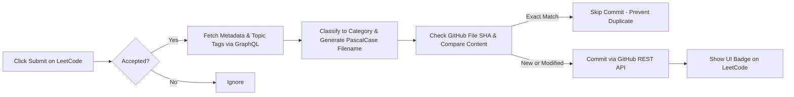

# ⚡ LeetCode Java DSA Solutions & Auto-Sync System

[](https://leetcode.com/)
[](https://www.java.com/)
[](https://github.com/nvsinha114-svg/dsa_leetcode)

This repository contains my personal collection of accepted **LeetCode Data Structures & Algorithms** solutions in **Java**, synchronized automatically via **LeetSync Pro** (included directly in the [`extension/`](./extension) folder).

---

## 📂 Repository Structure

Solutions are automatically classified into 17 distinct category folders based on problem topic tags:

```
dsa_leetcode/
│
├── Arrays/               # Arrays, Matrix, Simulation, Sorting
├── Strings/              # String manipulation, String Matching
├── Hashing/              # Hash Tables, Hash Maps, Sets
├── TwoPointers/          # Two Pointer techniques
├── SlidingWindow/        # Fixed & Dynamic Sliding Windows
├── PrefixSum/            # Prefix / Suffix Sums & 2D Prefix Sums
├── BinarySearch/         # Binary Search & Search Space Reduction
├── LinkedList/           # Singly & Doubly Linked Lists, Fast/Slow Pointers
├── Stack/                # Stacks, Monotonic Stacks
├── Queue/                # Queues, Monotonic Queues, Deques
├── BinaryTree/           # Binary Trees, Tree Traversals (DFS/BFS)
├── BST/                  # Binary Search Trees (Properties & Traversals)
├── Heap/                 # Heaps, Priority Queues
├── Greedy/               # Greedy Algorithms
├── Backtracking/         # Backtracking, Combinations, Permutations
├── Graph/                # Graphs, BFS, DFS, Union Find, Topological Sort, Dijkstra
└── DynamicProgramming/   # DP (1D, 2D, Knapsack, Intervals, Trees)
│
├── extension/            # Complete Manifest V3 Auto-Sync Browser Extension
└── tests/                # Verification test suites
```

---

## 📝 Solution File Standard Format

Every synchronized Java file uses clean **PascalCase** naming and includes standardized metadata at the top:

```java
/*
LeetCode #1
Problem: Two Sum
Difficulty: Easy
URL: https://leetcode.com/problems/two-sum/
Time Complexity: O(n)
Space Complexity: O(n)
*/

class Solution {
    public int[] twoSum(int[] nums, int target) {
        Map<Integer, Integer> map = new HashMap<>();
        for (int i = 0; i < nums.length; i++) {
            int complement = target - nums[i];
            if (map.containsKey(complement)) {
                return new int[] { map.get(complement), i };
            }
            map.put(nums[i], i);
        }
        return new int[0];
    }
}
```

---

## ⚡ How the Automatic Sync System Works



### Key Highlights:
- **Zero Manual Effort**: No copy-pasting code or running manual `git` commands.
- **Accepted Only**: Submissions resulting in *Wrong Answer*, *Time Limit Exceeded*, or *Runtime Error* are automatically ignored.
- **Duplicate Prevention**: Before committing, the background worker checks the existing file on GitHub. If the code is identical, no duplicate commit is created.
- **Atomic Commits**: Standard commit messages (e.g. `feat: add leetcode #1 two sum` or `refactor: update leetcode #1 two sum`).
- **Security First**: GitHub Personal Access Tokens are stored strictly in your local browser storage (`chrome.storage.local`) and never committed.

---

## 🚀 Quick Setup Guide (3 Steps)

### Step 1: Generate a GitHub Personal Access Token (PAT)
1. Go to [GitHub Settings &rarr; Developer Settings &rarr; Personal Access Tokens &rarr; Tokens (classic)](https://github.com/settings/tokens).
2. Click **Generate new token (classic)**.
3. Note: `LeetSync Pro`.
4. Select the **`repo`** scope (full control of private repositories).
5. Click **Generate token** and copy your token (`ghp_...`).

### Step 2: Load the Extension in your Browser
1. Open Google Chrome, Microsoft Edge, or Brave.
2. Navigate to `chrome://extensions/` (or `edge://extensions/`).
3. Turn on **Developer mode** (toggle in top right).
4. Click **Load unpacked**.
5. Select the `extension/` folder inside this repository:
   ```
   c:\Users\nvsin\dsa_leetcode\extension
   ```

### Step 3: Configure and Test
1. Click the **LeetSync Pro** icon in your browser toolbar.
2. Paste your **GitHub PAT**.
3. Confirm Owner: `nvsinha114-svg`, Repository: `dsa_leetcode`, Branch: `main`.
4. Click **Test Connection** &rarr; verify the green **Connected** badge appears.
5. Click **Save Settings**.

---

## 🧪 Testing with a Problem

1. Go to LeetCode (e.g., [Problem #1 - Two Sum](https://leetcode.com/problems/two-sum/)).
2. Select **Java** and write/paste an accepted solution.
3. Click **Submit**.
4. Once LeetCode displays **Accepted**, watch the bottom right of your screen:
   - A green toast appears: `✅ LeetSync: Successfully synced Arrays/TwoSum.java to GitHub!`
5. Refresh this GitHub repository—your solution is committed and organized into its folder!
